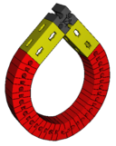
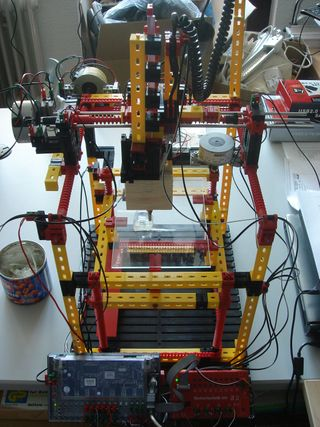
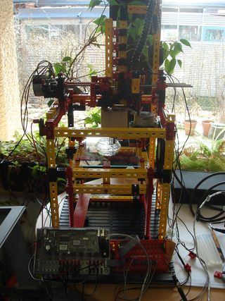
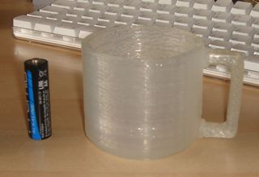

# ftistrap #

a fully functional 3D printer made with fischertechnik

<table align="right"><tbody><tr><td>
   FTIStrap-Logo
</td></tr></tbody></table> 
This page describes the "FTIStrap", a RepStrap [1,2] which is almost completely built from fischertechnik [3] parts. Constructing an FTIStrap neither needs any special expertise nor any special tools and can usually be completed within a single working day. All parts can either be ordered online or found in many stores in your neighbourhood. After printing the parts for a RepRap the FTIStrap may even be disassembled again and its parts used for other projects.
 &nbsp; 

> Note: this description is basically a copy of what I published on [RepRap.org](https://reprap.org/wiki/FTIStrap) in 2009. It is duplicated here to keep it persistent only.

> Note: this documentation is currently _in progress_ - do not expect it to be finished before end of November

<table align="left"><tbody><tr><td>
   An overview of (an earlier version of) the FTIStrap
</td></tr></tbody></table> 

<table align="left"><tbody><tr><td>
   The current FTIStrap printing a funnel
</td></tr></tbody></table> 

<table align="left"><tbody><tr><td>
   A small coffee mug printed with the FTIStrap (in two steps: the handle was printed separately and then manually pasted onto the cup - that step was less precise than the actual printing) The battery next to the cup is an AA type (Mignon)
</td></tr></tbody></table> 

_Another note: it is done - the "didacta 2009" fair in Hannover is over! More than 400 visitors came to my booth in order to see the FTIStrap in action and learn about the underlying technology. And quite a few of them announced their intention to build a copy of this 3D printer!_

_The author knows of two first copies of the FTIStrap which have been built so far (in Germany and the Netherlands). Proceed to chapter "Copies of the FTIStrap" to see photographs of these models! Congratulations!_

_By the way: meanwhile, the FTIStrap has been elected as the "fischertechnik model of the period January to March 2009" (see http://www.fischertechnik.de, under "Fanclub" -> "Gallery") - Thanks to all who voted for me!_

